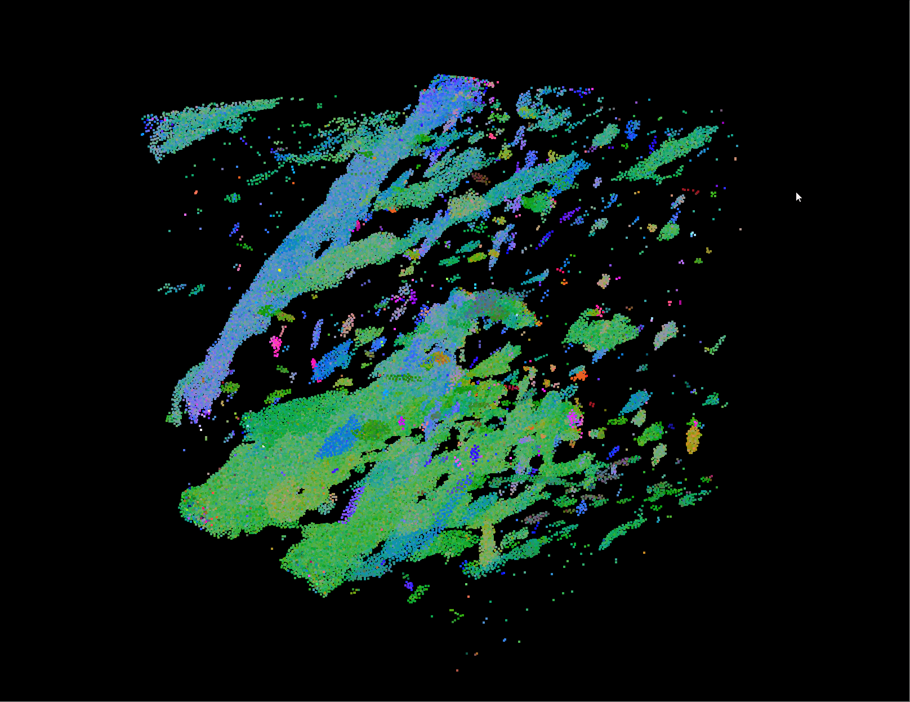
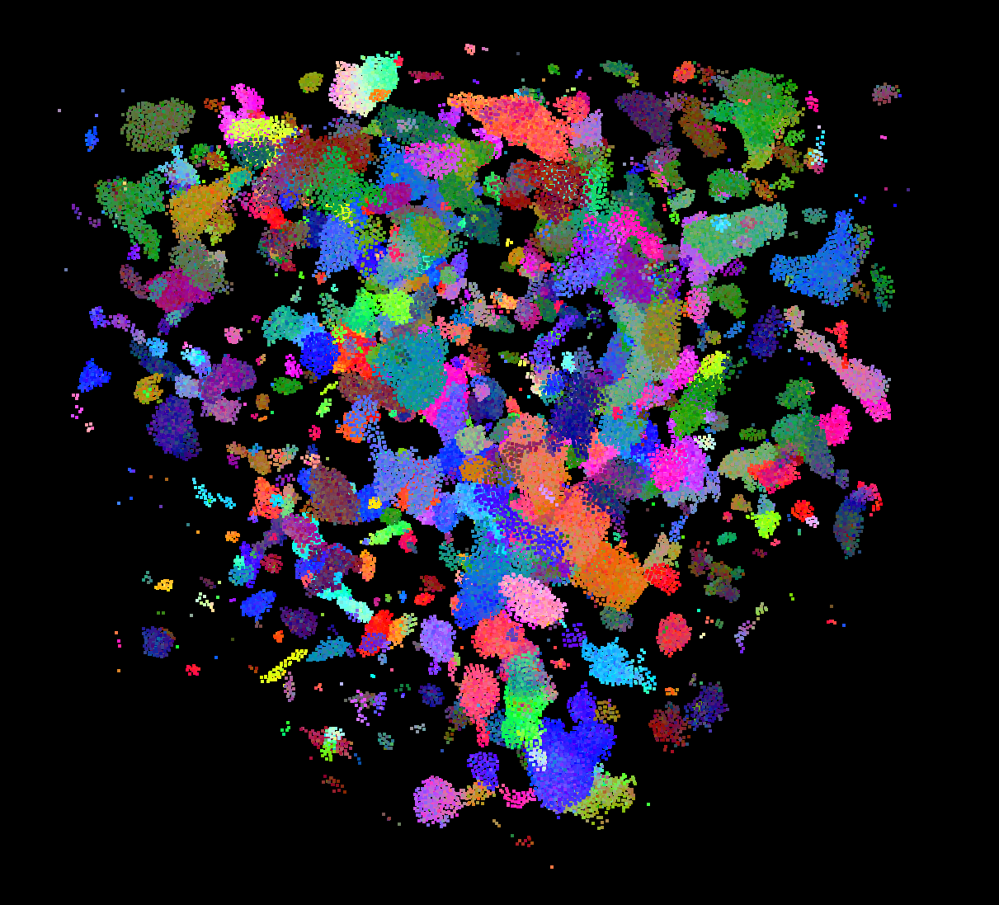
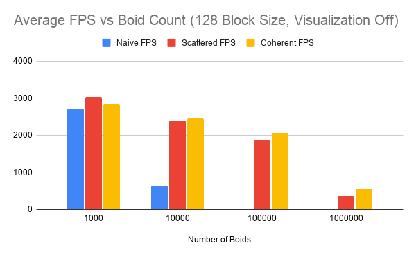
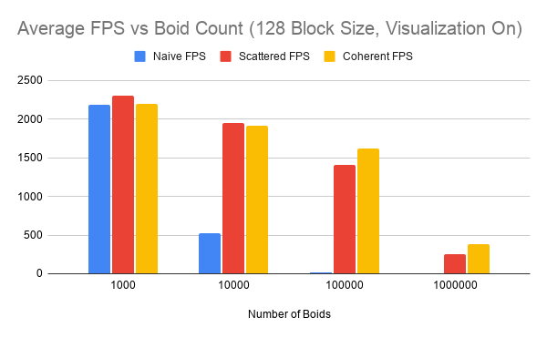
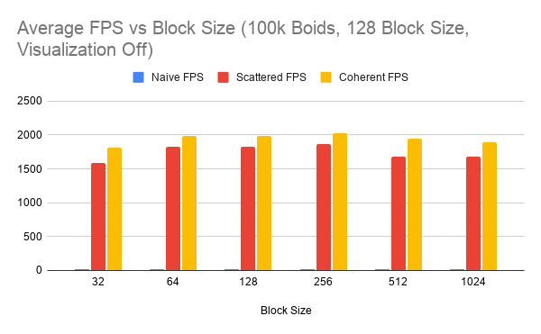
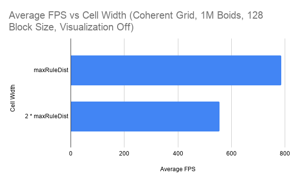

**University of Pennsylvania, CIS 5650: GPU Programming and Architecture,
Project 1 - Flocking**

* Nathan Chortek
  * [LinkedIn](https://www.linkedin.com/in/nathan-chortek/), [personal website](https://www.nathanchortek.com/)
* Tested on: Windows 11, AMD Ryzen AI 9 HX 370, NVIDIA GeForce RTX 5090 Laptop GPU

## Boids implementations

A "boid" is a particle with just two properties: position and velocity. At each step in the simulation, a given boid's velocity changes based on three rules that collectively simulate "flocking" as you'd see in a flock of birds or a school of fish:

1. Boids try to fly towards the center of mass of neighboring boids.
2. Boids try to keep a small distance away from other objects (including other boids).
3. Boids try to match velocity with near boids.

Each rule has a given distance that dictates how close two boids need to be in order for a given rule to contribute to a boid's velocity change. All three implementations of the algorithm compute the same three flocking rules; they differ only in how each boid finds its neighbors.

### Naive

Every boid tests every other boid. Total work is O(N²), with the second factor of N inside each thread: one thread per boid, looping over all N.

### Scattered uniform grid

Boids are binned into a uniform grid and sorted by cell index with `thrust::sort_by_key`, producing per-cell start/end index buffers. Each boid tests only the boids in cells that overlap its search radius. Position and velocity are read through an indirection array (`particleArrayIndices`), so `pos` and `vel` themselves stay in their original order.

### Coherent uniform grid

Same neighbor search, but `pos` and `vel` are permuted into cell-sorted order each frame by `kernSetSortedBoidData`. The layer of indirection disappears, and each cell's boids are now contiguous in memory.

The neighbor search I implemented for both the scattered and coherent grid implementations computes the axis-aligned bounding box (AABB) of the search sphere and iterates the cells it overlaps, rather than hard-coding an 8-cell offset. This stays correct for any cell width.

## Performance analysis

### Simulation parameters

| Parameter | Value |
|---|---|
| `scene_scale` | 200 (boids are generated in a 400³ cube) |
| Rule distances | `rule1Distance` 5.0, `rule2Distance` 3.0, `rule3Distance` 5.0 |
| `maxRuleDistance` | 5.0 (max of the three rule distances, computed during initialization) |
| Default `gridCellWidth` | 10.0 (`2 × maxRuleDistance`), so each boid searches a 2×2×2 = 8-cell AABB |
| `blockSize` | 128 |
| `DT` | 0.2 |

Because the scale of the scene is fixed at 400³, boid *density* grows linearly with boid count. This affects the performance analysis below.

### Device and kernel occupancy

Queried at runtime with `cudaGetDeviceProperties` and `cudaOccupancyMaxActiveBlocksPerMultiprocessor`:

| Device limit | Value |
|---|---|
| SMs | 82 |
| Max threads / SM | 1536 |
| Max blocks / SM | 24 |
| 32-bit registers / SM | 65536 |
| Warp size | 32 |

Both the block limit and the thread limit apply simultaneously, so the smaller one wins. Register counts can lower the occupancy ceiling further.

`kernUpdateVelocityBruteForce` (40 registers/thread):

| Block size | Blocks/SM | Threads/SM | Occupancy | Limiting occupancy factor |
|---|---|---|---|---|
| 32 | 24 | 768 | 50% | blocks/SM |
| 64 | 24 | 1536 | 100% | threads/SM |
| 128 | 12 | 1536 | 100% | threads/SM |
| 256 | 6 | 1536 | 100% | threads/SM |
| 512 | 3 | 1536 | 100% | threads/SM |
| 1024 | 1 | 1024 | 67% | threads/SM |

`kernUpdateVelNeighborSearchScattered` (47 registers/thread) and `kernUpdateVelNeighborSearchCoherent` (48 registers/thread) produce identical tables:

| Block size | Blocks/SM | Threads/SM | Occupancy | Limiting occupancy factor |
|---|---|---|---|---|
| 32 | 24 | 768 | 50% | blocks/SM |
| 64 | 20 | 1280 | 83% | registers |
| 128 | 10 | 1280 | 83% | registers |
| 256 | 5 | 1280 | 83% | registers |
| 512 | 2 | 1024 | 67% | registers |
| 1024 | 1 | 1024 | 67% | threads/SM |

Because the two neighbor-search kernels have effectively identical register counts, they have identical occupancy ceilings at every block size, so occupancy is controlled for when comparing them.

At 100% occupancy the brute-force kernel holds 82 × 1536 = **125,952** threads resident; the grid kernels at 83% hold 82 × 1280 = **104,960**.

### Measurement methodology

Average FPS was calculated with a Release build, `DT` 0.2, and V-Sync disabled. Additionally, the first 5 seconds after start-up are discarded so CPU and GPU clock speeds warm up and caches are populated.
Following this warm up period, the average is taken over the next 1000 frames. Fixing the measured frame count ensures sample sizes are identical across each implementation despite varying average FPS.
Measurements are taken with visualization off unless noted, helping to isolate compute costs from rendering costs.

### Impact of boid count

| Boids | Naive FPS | Scattered FPS | Coherent FPS |
|---|---|---|---|
| 1,000 | 2715 | 3039 | 2840 |
| 10,000 | 635 | 2395 | 2456 |
| 100,000 | 20 | 1867 | 2063 |
| 1,000,000 | <1 \* | 363 | 556 |

| Boids | Naive FPS | Scattered FPS | Coherent FPS |
|---|---|---|---|
| 1,000 | 2183 | 2299 | 2196 |
| 10,000 | 528 | 1946 | 1914 |
| 100,000 | 22 | 1410 | 1616 |
| 1,000,000 | <1 \* | 249 | 387 |

\* The naive 1M figures are estimates from the live frame counter, not harness measurements. At that rate a full 1000-frame run exceeds 17 minutes; the value is well under 1 FPS, which is all the analysis below relies on.

**Naive** degrades sharply: 2715 → 635 → 20 FPS across 1k, 10k, and 100k boids, or factors of 4.3× and 31.7× per step in boid count. This is the O(N²) total work: 10× the boids means 10× the threads *and* 10× the work per thread.
The steep decline in performance observed when moving from 10k boids to 100k boids happens below the resident-thread capacity (100k boids launches fewer threads than the 125,952 the kernel can hold resident on the GPU),
so running out of resident capacity and serializing execution into multiple waves of blocks is not the cause. Occupancy explains only why the observed factors fall short of the 100× per step in boid count that pure O(N²)
predicts: at 1k boids only 8 blocks are launched onto 82 SMs, so the 10× increase in threads lands on idle SMs and costs almost nothing; only the tenfold increase in per-thread work is actually paid for. By 100k the SMs
are full and the observed trend in performance moves closer to O(N²).

**Scattered and coherent** both scale far better with boid count than the naive implementation, particularly through 100k boids. Scattered's FPS falls only about 1.27× per 10× increase in boid count (3039 → 2395 → 1867 FPS),
and then it drops 5.1× at 1M boids. Coherent behaves the same way: 2840 → 2456 → 2063 FPS, about a 1.17× drop per 10× increase in boid count, before it drops 3.71× at 1M boids. Generally, this improved FPS scaling is due to the
uniform grid limiting the neighbor search step of the algorithm to a small AABB around each boid. Because the scene scale is fixed, boid density scales linearly with boid count. Each boid searches an 8-cell AABB in the uniform grid
implementations, whereas the naive implementation effectively searches the entire scene. That AABB holds an average of ~12 candidate neighbors at 100k boids and ~125 at 1M boids, far fewer candidate neighbors examined per boid compared to
the naive implementation, which explains the significantly better performance. Prior to 1M boids for the uniform grid implementations, it is likely that the cost of neighbor search is outweighed by the other steps of the algorithm:
kernel launches, the buffer resets performed by `kernResetIntBuffer` (which spawns one thread per grid cell rather than scaling by boid count), and the `thrust::sort_by_key` call. Sometime after 100k boids, the per-cell boid density
presumably becomes large enough that the neighbor check begins to outweigh the other per-frame work, leading to the sharper decline in FPS observed when we move from 100k to 1M boids.

### Impact of block size

Block count here is derived from block size: at fixed boid count it is `ceil(numBoids / blockSize)`, measured at 100k boids. "Waves" is blocks launched divided by resident block capacity (blocks/SM × 82) for a given kernel; a value above
1 means a second, partly empty wave must execute to complete that frame's work.

`kernUpdateVelocityBruteForce`:

| Block size | Blocks | Waves | Occupancy | Naive FPS |
|---|---|---|---|---|
| 32 | 3125 | 1.59 | 50% | 22 |
| 64 | 1563 | 0.79 | 100% | 22 |
| 128 | 782 | 0.79 | 100% | 19 |
| 256 | 391 | 0.79 | 100% | 22 |
| 512 | 196 | 0.80 | 100% | 20 |
| 1024 | 98 | 1.20 | 67% | 18 |

`kernUpdateVelNeighborSearchScattered` and `kernUpdateVelNeighborSearchCoherent`:

| Block size | Blocks | Waves | Occupancy | Scattered FPS | Coherent FPS |
|---|---|---|---|---|---|
| 32 | 3125 | 1.59 | 50% | 1581 | 1809 |
| 64 | 1563 | 0.95 | 83% | 1828 | 1979 |
| 128 | 782 | 0.95 | 83% | 1826 | 1988 |
| 256 | 391 | 0.95 | 83% | 1865 | 2026 |
| 512 | 196 | 1.20 | 67% | 1679 | 1946 |
| 1024 | 98 | 1.20 | 67% | 1685 | 1897 |

**Naive is insensitive to block size.** FPS varies 18-22 with no observed correlation to occupancy: the 50% configuration ties for best performance. Higher occupancy has the primary benefit of hiding latency: if one warp stalls while waiting
for data to be loaded, a different warp can execute until the dependent load finishes. The "problem" is probably that the Naive implementation's velocity update kernel has little memory latency to hide. All threads have to examine every index
of `pos` (and `vel` where rule 3 applies), so the vast majority of load instructions are likely to be broadcasts, which are the cheapest type of load.

**Scattered and coherent track occupancy tiers exactly.** The neighbor search is not the dominant cost at 100k boids, but it is likely the component whose occupancy drives the observed variation. `kernResetIntBuffer` (10 registers) and `kernComputeIndices` (12 registers)
reach 100% occupancy at block sizes 64 through 512, while the neighbor search kernels are register-capped at 83% and fall to 67% at block size 512. Block size 512 is where the two kernel groups disagree, and FPS follows the neighbor search kernels: Scattered drops from 1865 to
1679 average FPS there, which the lower-register kernels' occupancy cannot explain. So the neighbor search kernels' limits are the relevant ones: at 32 threads the 24-blocks-per-SM cap binds, allowing only 768 threads/SM; at block sizes 64-256 the register count caps occupancy
at 1280 threads/SM; at block sizes 512 and 1024 it drops to 1024 threads/SM. Three occupancy tiers map onto three FPS tiers with correct ordering and no exceptions. Additionally, the three fastest configurations (block sizes 64, 128, and 256) are exactly the three that fit within
a single wave of blocks. At block sizes 32, 512 and 1024 the second wave is only 20-59% full, leaving many SMs idle. Occupancy and wave count predict the same performance categories at every block size. This makes sense, because wave count and occupancy are not independent here:
both derive from resident capacity, so lower occupancy also means more waves at every block size.

### Scattered vs coherent performance

At higher boid counts, the Coherent implementation is faster than the Scattered implementation (2.5% at 10k boids, 10.5% at 100k boids, and 53% at 1M boids). This was expected, because the Coherent implementation intentionally aligns its data layout in memory with its data access
patterns. Both uniform grid neighbor search kernels assign threads in cell-sorted order, so in both cases a warp's threads handle boids that are physically close in 3D space. The difference is what that proximity buys. In the scattered version, spatially adjacent boids hold arbitrary
indices into `pos` and `vel`, so closeness in space implies nothing about closeness in memory. Permuting the arrays converts spatial proximity into memory proximity, which pays off in a couple of ways. First, a given boid's neighbor candidates span far fewer distinct cache lines, so
lines fetched by one warp get reused by the next. Second, one dependent load instruction disappears, because a neighbor's address is known directly rather than after a lookup in `particleArrayIndices`. Since the two kernels have effectively identical register counts and occupancy, the
difference is very likely to come from memory behavior rather than from parallelism.

What I did *not* expect, however, is that the Coherent implementation is 6.5% **slower** at 1k boids (2840 vs 3039 FPS), and this reproduces with visualization on (2196 vs 2299 FPS). The Coherent implementation pays an extra kernel launch plus an O(N) reorder pass each frame, and when the
neighbor search is nearly free at very low boid counts that cost appears to outweigh the performance gains from better caching behavior.

### Impact of cell width

At 1M boids, the Coherent implementation runs at **786 FPS** with `cellWidth = maxRuleDistance` (a 27-cell AABB) versus **556 FPS** with `cellWidth = 2 × maxRuleDistance` (an 8-cell AABB). Checking more cells actually turned out to be faster, which suggests that cell count is the wrong
quantity to reason about. What actually determines the amount of work done during neighbor search is the **volume searched**, since that sets how many candidate boids get distance-tested. Since my neighbor search only iterates over the boids in grid cells that intersect with the AABB
of a sphere with a radius of `maxRuleDistance`, having grid cells of smaller volumes means each cell is less likely to contain boids that fail to lie within the search sphere itself. This directly translates to less time spent checking candidate boids that turn out to not be valid neighbors,
which explains the observed FPS data.
